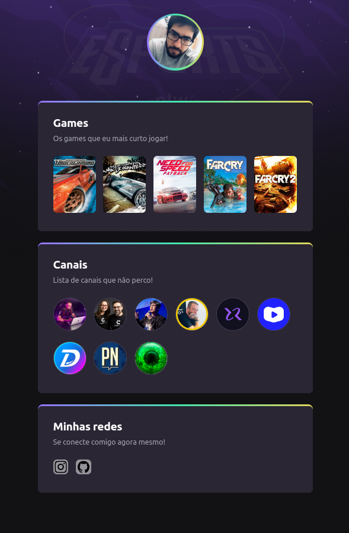

# NLW eSports - Trilha Explorer

> Trilha Explorer

Projeto construído no evento Next Level Week da Rocketseat. 
*Atualizado em 30 de Junho de 2024*

[click aqui para acessar a página](https://samuelcarneiro.github.io/nlw-esports-explorer/)

## Tecnologias utilizadas

## Contato

